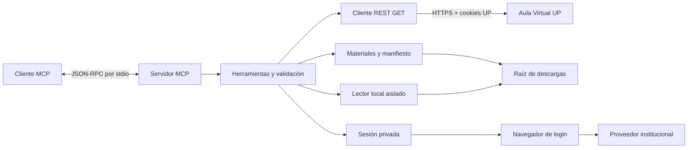

# Arquitectura

## Capas

- `mcp/` publica identidad, herramientas, prompts y guía. No inicia consultas académicas durante el handshake.
- `blackboard/tools.ts` valida parámetros, obtiene sesión y conecta consultas con descargas.
- `blackboard/participation-tools.ts` registra las consultas de discusiones, grupos, asistencia y datos propios; no permite elegir otra cuenta.
- `blackboard/student-tools.ts` registra fuentes institucionales, recorridos y consultas entre cursos, comprobantes propios, biblioteca y exportaciones adicionales.
- `blackboard/api/` usa Axios, limita el destino, bloquea métodos diferentes de GET, pagina colecciones, coordina peticiones y reutiliza respuestas brevemente.
- `blackboard/services/` combina los mismos endpoints de lectura para resumen, agenda, búsqueda, inventarios y detalle de actividades. Declara fuentes fallidas y aplica límites al recorrido. Las exportaciones locales ICS/CSV usan el escritor con rutas, cuotas y publicación exclusiva.
- `blackboard/services/participation.ts` cruza asistencia con los IDs de sesiones del curso, verifica identidad en datos propios y conserva los estados ausentes o restringidos. La agenda múltiple mantiene cada sección por ID.
- `blackboard/auth/` guarda cookies solo del ámbito de Blackboard, verifica caducidad con el servidor y coordina renovación. El estado SSO Microsoft adicional es optativo y cifrado.
- `downloads/` recorre contenidos/actividades, conserva carpetas y escribe la procedencia.
- `library/` inventaría y lee documentos ya descargados dentro de la raíz privada. PDF.js y las partes XML de Office se procesan en un worker con límites de memoria, tiempo, entrada y descompresión. Sus registros no entran en stdout del protocolo; no ejecuta scripts, macros ni fórmulas.
- `security/files.ts` restringe rutas, rechaza enlaces simbólicos, coordina cuotas y publica archivos completos.
- `runtime/` abre navegador instalado o Chromium y coordina lanzamientos.

## Transporte y cuentas

Cada proceso atiende una cuenta local. No hay listener HTTP, base de datos compartida, API administrativa ni conexión a otros servicios académicos. stdout contiene exclusivamente mensajes MCP durante el modo servidor; mensajes del login se envían a stderr.

Las peticiones de metadatos tienen hasta cuatro operaciones concurrentes por clave de sesión. Las descargas desde el cliente Blackboard se serializan con una pausa de 350 ms. La caché de GET dura 20 segundos y no guarda streams. Las descargas redirigidas al CDN emplean un cliente sin cookies y no pasan por esa misma cola; el recorrido normal de un curso las solicita secuencialmente.

## Descargas y procedencia

`manifest.json` identifica el curso, archivos, páginas, actividades, errores, referencias externas y cambios conocidos. Los adjuntos existentes se reutilizan o se conservan con nombres únicos. Los Markdown generados y el manifiesto se actualizan mediante archivos temporales: son salidas mantenidas por el MCP, no archivos personales de entrada.

Las credenciales UP nunca se envían al CDN. Se validan destinos `alt-*.blackboard.com` por HTTPS y se limita la cadena de redirecciones. Los enlaces ajenos se conservan como referencias, sin descargar automáticamente.

La detección incremental usa identificadores, nombres y metadatos; no descarga todo para calcular hashes remotos. Un reemplazo que no cambie esos metadatos puede pasar inadvertido. Las retiradas se anotan en el manifiesto sin eliminar originales locales.

## Verificación

Las pruebas separan funciones de texto, rutas, cuotas, sesiones, concurrencia y paginación. La prueba stdio arranca un proceso independiente en un directorio temporal sin cuenta, comprueba catálogo, recursos, prompts y rechazo de parámetros. Los paquetes se generan a partir de listas permitidas y se inspeccionan antes de distribuir.
