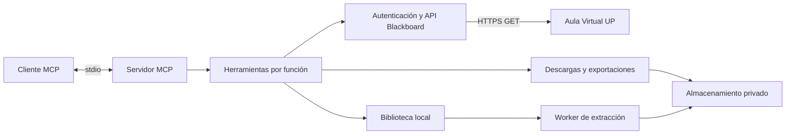

# Arquitectura

[Índice de documentación](../README.md)

El servidor atiende una cuenta por proceso. El cliente MCP se comunica por stdio; las consultas académicas usan HTTPS contra Aula Virtual UP. La biblioteca y las exportaciones trabajan en el almacenamiento privado del usuario.



## Organización del código

```text
src/
  index.ts                 Entrada CLI y proceso stdio
  mcp/
    server.ts              Composición del servidor
    prompts.ts             Cinco prompts de uso
    resources.ts           Recurso de guía institucional
    institution.ts         Instrucciones de alcance UP
    tools/
      index.ts             Registro de las 70 herramientas
      context.ts           Sesión, esquemas y respuestas compartidas
      session.ts           Inicio, cierre e identidad
      courses.ts           Cursos, inscripción y resúmenes
      contents.ts          Estructura, búsqueda, sílabos y revisión
      announcements.ts     Anuncios de curso e institucionales
      assessment.ts        Actividades, intentos y notas propias
      calendar.ts          Eventos y agendas
      participation.ts     Discusiones, grupos y asistencia
      downloads.ts         Descargas de materiales
      library.ts           Consultas de documentos locales
      exports.ts           Copias privadas de datos académicos
      advanced.ts          Versión del servidor y GET público
  blackboard/
    config.ts              Dominio UP y sesión privada
    types.ts               Tipos de Blackboard y sesión
    auth/                  Acceso, caducidad, renovación y SSO opcional
    api/                   Cliente GET, endpoints y paginación
    services/              Consultas combinadas y formatos de exportación
  downloads/               Recorridos y manifiestos de materiales
  library/                 Inventario y extracción de texto
  security/                Rutas, cuotas y escritura de archivos
  runtime/                 Navegador y coordinación de operaciones
```

`mcp/` contiene el contrato con el asistente. `blackboard/` contiene la integración académica y no depende del registro de herramientas. Los módulos de archivos aplican los mismos controles de ruta a descargas, lectura y exportaciones. La ruta pública de arranque se conserva en `dist/index.js`.

## Sesión y consultas

El registro de herramientas, prompts y recursos no realiza consultas autenticadas. Las herramientas remotas obtienen la sesión al ejecutarse; las consultas de notas, asistencia e intentos propios usan la identidad de esa sesión. Las consultas locales de biblioteca no requieren iniciar sesión.

El adaptador HTTP valida el método GET y el origen antes de enviar cookies. Las consultas de metadatos admiten hasta cuatro operaciones concurrentes por sesión; las descargas desde Blackboard se serializan con una pausa de 350 ms. La caché GET dura 20 segundos y no almacena streams.

Las redirecciones admitidas a `alt-*.blackboard.com` se descargan mediante HTTPS sin cookies institucionales. El recorrido normal solicita esos archivos secuencialmente. Los enlaces externos se conservan como referencias.

## Archivos y documentos

Los archivos se guardan dentro de la raíz de descargas configurada. `manifest.json` conserva sección, procedencia, errores, referencias y cambios conocidos. La detección incremental se basa en IDs y metadatos; una sustitución que no los cambie puede pasar inadvertida.

PDF y Office se extraen en un worker aislado, con límites de memoria, tiempo, entrada y descompresión. Los documentos se tratan como datos; no se ejecutan scripts, macros ni fórmulas. La biblioteca no hace OCR. Sus registros se consumen fuera de stdout para conservar el protocolo MCP.

## Compilación y verificación

La compilación reconstruye `dist/` para que una reorganización no deje módulos antiguos dentro de los paquetes. `npm run check` verifica tipos, pruebas con datos ficticios, un proceso MCP real, enlaces de documentación y archivos distribuibles.

El ZIP fuente y el paquete compilado usan listas permitidas. Las sesiones, los perfiles de navegador, las descargas y las exportaciones privadas quedan fuera de la distribución. La matriz CI cubre Linux, Windows y macOS con Node 22 y 24.
